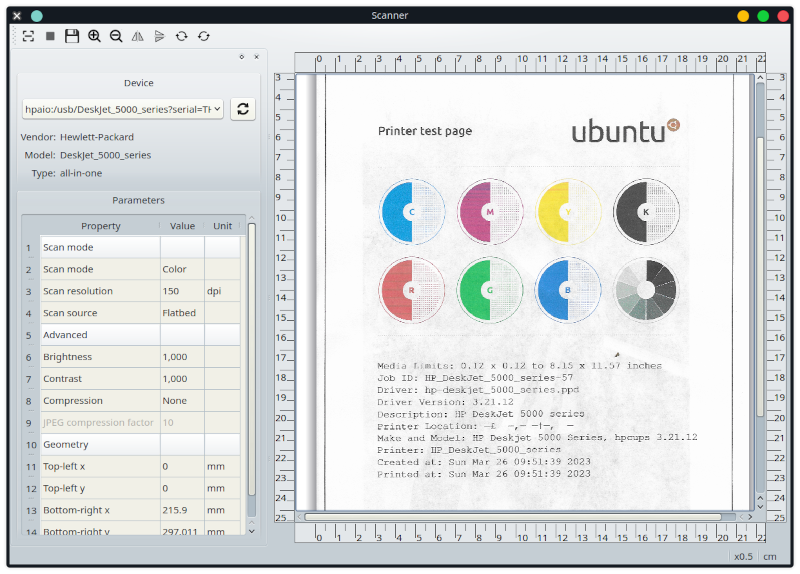

# SANE C++ Wrapper and Sample GUI

## Intro

[SANE](https://sane-project.org) is a scanner access generic library for Linux-like systems. It
offers C API interface with flexible features and runtime scanner property access. This small
project is an attempt to build C++ wrapper around it and minimal GUI using the wrapper. It's just an
educational activity and can't be considered for any production cases so far. Sorry. You may be
interesting in [Insane Library](https://gitlab.gnome.org/World/OpenPaperwork/libinsane) instead.

## Notes

1. It looks like SANE library doesn't make proper cleanup on sane_exit() call - calling it after the
main thread has finished a main procedure entry point causes the library to raise a seg-fault. I guess
the library starts some cleaning in its (previously registered) atexit() handler leaving itself in
intermediate state. When my wrapper goes to be destroyed and calls sane_exit() - something finally
breaks in the library.

2. Clang doesn't compile some constructs with std::ranges::subrange usage - there are a number of
bug reports in Internet.  So the project can be compiled with gcc so far.

3. [GUI] QGridLayout has no ability to tell its parent about maximum size constraint. It looks like
Qt developers decided that it can be resized to infinite size always. So there is no possibility to
make a dialog window with this layout having minimum reasonable size with maximum possible size
limitation. Spending a few days on debugging I've found out (trivially, isn't it?) that QGridLayout
is derived from QLayout with has no any constraints unlike more usual
QBoxLayout/QHBoxLayout/QVBoxLayout - they actually do limiting corresponding sizes. Maybe there is
no need in this maximum size constraint because this layout has initially minimum size in case of
other components near it who wants to occupy space.

4. It's a design question whether to make full types isolation in boundary classes (the wrapper
library in this project) or to propagate internal types closer to GUI. The former requires too much
work in most cases but makes code better separated into different domains.

5. Supporting runtime type checks/constraints in GUI is really laborious work - I understand why
many similar projects have poor look-and-feel and bad internal state representation in GUI. Not sure
I will have enough passion to move this one forward further then others.

6. The more I implement the GUI as "simple usage of C++ wrapper" the more this GUI becomes much more
complicated than C++ wrapper itself. The latter looks like just very simple piece of code which
doesn't make any clever things. Recently I've found that I've complicated GUI/worker threads
interaction too much - most of Qt's signal stuff can be thrown away. But anyway GUI tends to be much
more complicated than a scanner wrapper library. I've re-designed all operations except scanning to
be considered as atomic and don't require to be running in the worker thread. And the scanning is
implemented asynchronously right inside the wrapper library.

7. I couldn't get proper cancelling of scanning from my HP DeskJet 5000 series device. SANE doc
clearly mentions that sane_cancel() call can be executed from a signal handler when the scanning is
in progress. But it yields to deadlock if I set the signal handler to be executed in a context of a
scanning thread. And it yields to a crash when it's called from context of any other thread. The
same thing happened if I just call sane_cancel() from another (GUI) thread. I've tried to call it in
the middle of scanning normally between reading pieces of data - it blocks until my device finishes
its work. Too much code and efforts to get cancelling to work - looks like HP backend developers
didn't pay enough attention on this.

8. Assuming (7) there is no way to properly cancel scanning process if a device has been
disconnected accidentally. Reading operation just blocks infinitely - nobody can force it to return
with any code.
